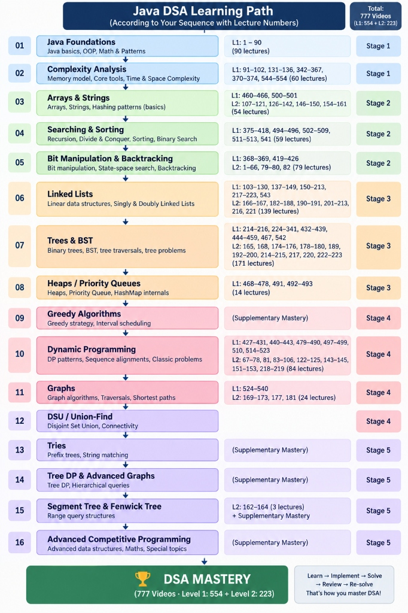

# 🗺️ Pepcoding DSA Roadmap Tracker & Study Tool

<p align="center">
  <b>A free, open-source, interactive curriculum and progress tracker for mastering Data Structures & Algorithms with Pepcoding (Level 1 + Level 2) and curated LeetCode problems.</b>
</p>

<p align="center">
  <a href="https://vaibhavtiwari006.github.io/Pepcoding-DSA-Roadmap/"></a>
  <a href="https://www.youtube.com/playlist?list=PL-Jc9J83PIiFj7YSPl2ulcpwy-mwj1SSk"></a>
  <a href="https://leetcode.com/"></a>
  <a href="https://github.com/VaibhavTiwari006/Pepcoding-DSA-Roadmap/blob/main/LICENSE"></a>
</p>

> ### 🌐 **Live Web Application (Free & No Signup Needed)**
> 👉 **[https://vaibhavtiwari006.github.io/Pepcoding-DSA-Roadmap/](https://vaibhavtiwari006.github.io/Pepcoding-DSA-Roadmap/)**
> 
> *Open in your browser, pick a topic, watch the video, solve practice problems, and check them off. Your progress is saved automatically on your device.*

<p align="center">
  <a href="https://vaibhavtiwari006.github.io/Pepcoding-DSA-Roadmap/">
    
  </a>
</p>

---

## ✨ What is this Tool?

The **Pepcoding DSA Roadmap Tracker** is a client-side web tool created for anyone learning Data Structures and Algorithms from Pepcoding.

While Pepcoding's 777 video catalog (Level 1 and Level 2) is one of the most thorough DSA resources available, navigating across hundreds of videos and knowing **which LeetCode questions to solve after each lecture** can be overwhelming.

This tool solves that by providing:
- 📌 **A Prerequisite-Ordered 15-Phase Roadmap**: Clear path from Stage 1 (Foundations) to Stage 5 (Advanced Competitive Programming).
- 🎥 **Exact Video Lecture Ranges**: Tells you precisely which Pepcoding video numbers to watch for each topic (e.g., `L1 Videos 1–90`, `L1: 460–466 · L2: 107–121`).
- 🎯 **550+ Hand-Picked LeetCode Practice Questions**: Curated topic-wise from Kunal Kushwaha's assignments and categorized by difficulty (**Easy**, **Medium**, **Hard**).
- 💾 **Local-First, Private Progress Tracking**: Check off topics and practice questions as you complete them; everything is saved in your browser.

---

## ⚡ How to Use this Tool for Your DSA Prep

```
  ┌────────────────────────────────────────────────────────┐
  │ 1. Open the Web App                                    │
  │    Visit https://vaibhavtiwari006.github.io/Pepcoding-DSA-Roadmap/ │
  └──────────────────────────┬─────────────────────────────┘
                             │
                             ▼
  ┌────────────────────────────────────────────────────────┐
  │ 2. Follow the 15 Structured Phases                     │
  │    Start from Phase 1 (Java Foundations) or your level │
  └──────────────────────────┬─────────────────────────────┘
                             │
                             ▼
  ┌────────────────────────────────────────────────────────┐
  │ 3. Watch the Lecture on YouTube                        │
  │    Use the video range (e.g., "L1 Videos 91–102")      │
  └──────────────────────────┬─────────────────────────────┘
                             │
                             ▼
  ┌────────────────────────────────────────────────────────┐
  │ 4. Expand "Practice" & Solve LeetCode Problems         │
  │    Click on Easy ➔ Medium ➔ Hard problems to practice  │
  └──────────────────────────┬─────────────────────────────┘
                             │
                             ▼
  ┌────────────────────────────────────────────────────────┐
  │ 5. Check off Completed Items                           │
  │    Progress bars and counters update instantly         │
  └────────────────────────────────────────────────────────┘
```

---

## 📺 Official Pepcoding YouTube Playlists

Direct links to the official video lectures referenced across this roadmap:

| Level | Content Covered | Lecture Count | YouTube Playlist Link |
|---|---|---|---|
| **DSA Level 1** | Language Basics, Arrays, Recursion, Trees, Stacks, Queues, Hashmaps, Heaps, DP, Graphs | **554 Videos** | [▶️ Watch Level 1 Playlist](https://www.youtube.com/playlist?list=PL-Jc9J83PIiFj7YSPl2ulcpwy-mwj1SSk) |
| **DSA Level 2** | Advanced Recursion, Bit Manipulation, Advanced DP, Morris Traversal, Advanced Graphs, Sqrt Decomposition | **223 Videos** *(446 entries)* | [▶️ Watch Level 2 Playlist](https://www.youtube.com/playlist?list=PL-Jc9J83PIiE-181crLG1xSIWhTGKFiMY) |

---

## 🚀 Key Features

- **🎯 Dual-Layer Checklists**:
  - Track **Topic Blocks** (62 total modules).
  - Track individual **LeetCode Questions** (550+ curated problems) with separate progress counters.
- **🔒 100% Privacy (Local-First Storage)**:
  - No login, no database, no tracking.
  - All data is saved inside your own browser via `localStorage`. Multiple students using the same link have completely independent, isolated progress.
- **🔄 Export & Import Data**:
  - Download your progress as a `dsa-master-roadmap-v3.json` backup file.
  - Easily transfer your completed checklists between your laptop, desktop, and mobile phone.
- **🔍 Real-Time Search & Filters**:
  - Filter topics by *Level 1*, *Level 2*, *Supplementary*, *Completed*, or *Pending*.
  - Search any algorithm pattern or topic (e.g., *Sliding Window*, *LCS*, *DSU*, *Morris Traversal*, *Dijkstra*).
- **📱 Responsive & Clean UI**:
  - Dark-mode developer aesthetic inspired by developer terminal interfaces.
  - Collapsible topic drawers so you can focus on one phase at a time without visual clutter.

---

## 📚 Complete 15-Phase Curriculum Map

```
├── Tier 1: Core Foundations & Memory Architecture
│   ├── Phase 01: Java Foundations, Math & Patterns (L1: 1–90)
│   └── Phase 02: Linear Memory, Core Tools & Complexity (L1: 91–102, 131–136, 342–374, 544–554)
│
├── Tier 2: Algorithmic Thinking & State Space
│   ├── Phase 03: Essential Array, String & Hashing Patterns (L1: 460–466 · L2: 107–161)
│   ├── Phase 04: Recursion, Divide & Conquer, Sorting & BS (L1: 375–418, 494–513, 541)
│   └── Phase 05: Bit Manipulation, State-Space & Backtracking (L1: 368–426 · L2: 1–82)
│
├── Tier 3: Core Data Structures
│   ├── Phase 06: Linear Data Structures & Doubly Linked Lists (L1: 103–223 · L2: 166–221)
│   ├── Phase 07: Hierarchical Structures — Trees & BST (L1: 214–467 · L2: 165–223)
│   └── Phase 08: Priority Queues, Heaps & Hash Internals (L1: 468–501)
│
├── Tier 4: Optimization, Sequences & Network Topology
│   ├── Phase 09: Greedy Algorithms & Interval Scheduling (Supplementary Mastery)
│   ├── Phase 10: Dynamic Programming & Sequence Alignments (L1: 427–523 · L2: 67–219)
│   └── Phase 11: Graph Algorithms, DSU & Connectivity (L1: 524–540 · L2: 169–181)
│
└── Tier 5: Advanced & Competitive Specialisations
    ├── Phase 12: String Matching & Prefix Trees (Tries)
    ├── Phase 13: Tree DP & Hierarchical Graph Queries
    ├── Phase 14: Range Query Structures (Segment & Fenwick Trees, Sqrt Decomposition)
    └── Phase 15: Competitive Specialisation & Advanced Math
```

---

## 🛠️ Self-Hosting / Running Locally

Since this tool is built purely with static web technologies (zero build steps, zero dependencies), you can run it or host your own copy in seconds:

### Option A: Run Locally
```bash
# 1. Clone the repo
git clone https://github.com/VaibhavTiwari006/Pepcoding-DSA-Roadmap.git
cd Pepcoding-DSA-Roadmap

# 2. Open index.html directly in any browser
# (or serve with Python / Node)
python -m http.server 8000
```

### Option B: Deploy Your Own Free Copy on GitHub Pages
1. Click **Fork** at the top-right of this repository.
2. Go to your forked repository's **Settings** ➔ **Pages**.
3. Under **Build and deployment**, select **Source: Deploy from a branch** ➔ Branch: `main` / `root`.
4. Your personal tracker will be live at `https://<your-username>.github.io/Pepcoding-DSA-Roadmap/`.

---

## 🤝 Contributing & Suggestions

Suggestions, problem sheet additions, and improvements are welcome!

1. Fork the repo.
2. Create a feature branch (`git checkout -b feature/topic-addition`).
3. Commit your changes (`git commit -m "Add new LeetCode questions for DP"`).
4. Push to the branch (`git push origin feature/topic-addition`).
5. Open a **Pull Request**.

---

## 🌟 Acknowledgements & Credits

- **[Pepcoding (Sumeet Malik)](https://www.youtube.com/@Pepcoding)** — for the comprehensive DSA Level 1 & Level 2 video lecture series.
- **[Kunal Kushwaha](https://github.com/kunal-kushwaha/DSA-Bootcamp-Java)** — for the curated assignment problem repository.
- **[LeetCode](https://leetcode.com/)** — for the problem platform.

---

## 📄 License

Distributed under the **MIT License**. See [`LICENSE`](./LICENSE) for details.

<p align="center">
  <b>Star ⭐ this repository if you find it helpful for your DSA prep!</b><br>
  <sub>Maintained by <a href="https://github.com/VaibhavTiwari006">Vaibhav Tiwari</a></sub>
</p>
